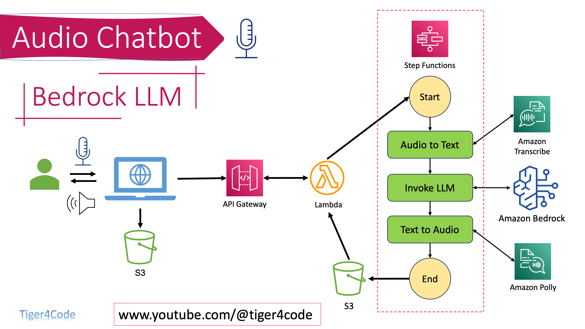

# Audio ChatBot using Bedrock LLM

This project demonstrates a workflow that involves recording user audio, uploading it to Amazon S3, and then triggering a series of AWS services to process the audio and provide a response to the user's query using Generative AI LLMs.

## Workflow Steps

1. Record audio from the user.
2. Upload the audio file to an S3 bucket.
3. Initiate an API Gateway call to trigger a Lambda function that starts the execution of a Step Function.

### Step Function Workflow

The Step Function consists of the following three phases:

1. **Transcription:** Using the Amazon Transcribe service, the WAV audio file is converted to text.
2. **Answer Generation:** A Lambda function calls the Amazon Bedrock LLM, utilizing the Jurassic-2 LLM, to generate a response to the user's query.
3. **Audio Generation:** The text response is converted to audio using Amazon Polly, and the resulting audio file is stored in an S3 bucket.

## Solution Architecture

<!-- Placeholder for Solution Architecture Diagram -->

### Usage

1. Follow the setup steps outlined in the [Audio ChatBot using Bedrock LLM, Transcribe, and Polly: Complete Workflow Tutorial (video)](https://youtu.be/ulk2UwK8rpE) to configure and set up the necessary resources on the cloud.
2. Clone the repository.
3. Create a Python virtual environment, activate it, and install the required libraries listed in the `requirements.txt` file using the command: `pip install -r requirements.txt`.
4. Navigate to the `1-main-app-record-audio` directory.
5. Run the application using the command: `python 1-record_audio_upload2s3.py`.

### Requirements

- AWS account with access to Amazon S3, Amazon Transcribe, Amazon Polly, AWS Lambda, and AWS Step Functions.
- Python and necessary dependencies installed for local testing.

For any questions or support, please contact us at www.youtube.com/@tiger4code by writing a comment under the following video [Audio ChatBot using Bedrock LLM, Transcribe, and Polly: Complete Workflow Tutorial](https://youtu.be/ulk2UwK8rpE).